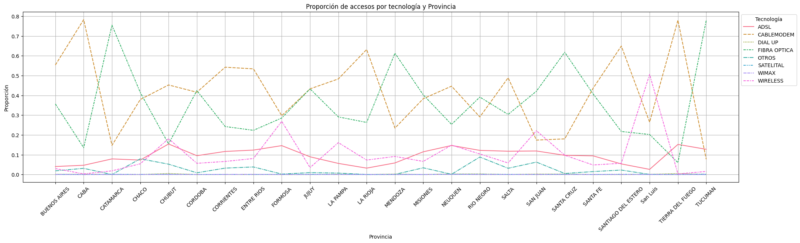
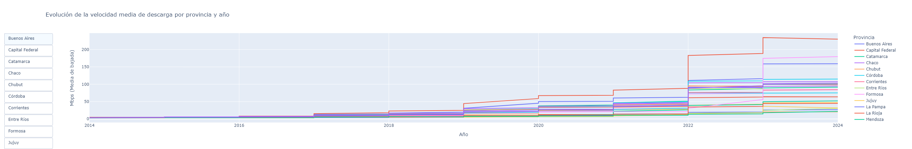
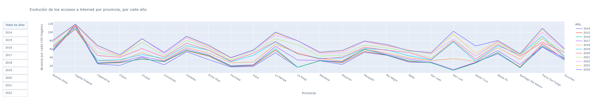
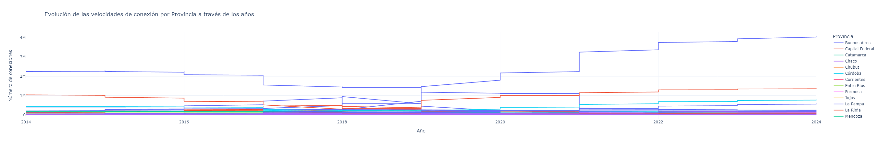
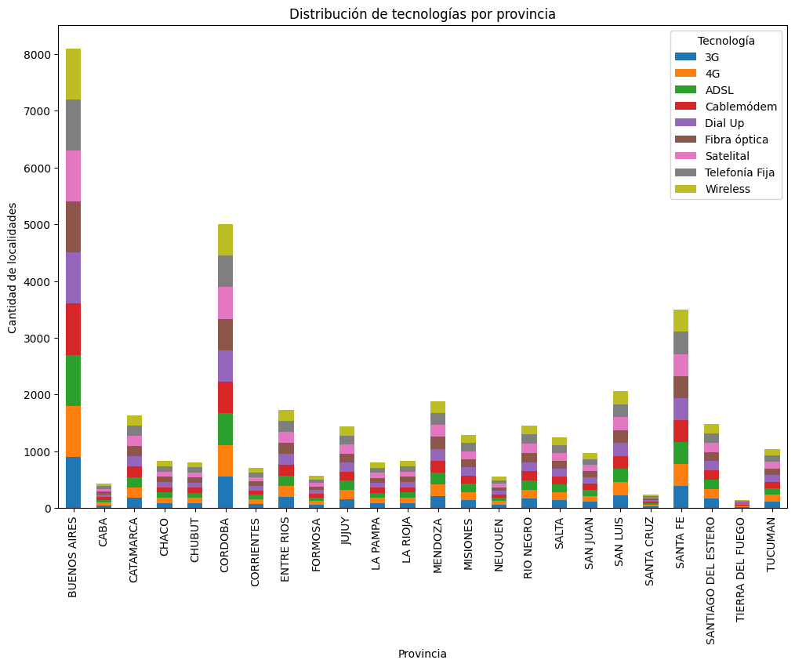

# Penetración y Calidad del Acceso a Internet en Argentina: Un Estudio Basado en Datos Públicos

Este estudio se propone analizar en profundidad la conectividad a internet en Argentina. A través del procesamiento de datos públicos, se busca cuantificar la penetración del servicio, caracterizar las tecnologías utilizadas, evaluar la calidad de las conexiones y, finalmente, identificar las brechas digitales existentes entre las distintas regiones del país. Los resultados obtenidos servirán como base para comprender el estado actual de la conectividad y proponer estrategias para mejorar el acceso y la calidad del servicio a nivel nacional.

## Dominancia Tecnológica y Transición Digital

La fibra óptica se consolida como la tecnología predominante en las principales ciudades, impulsada por una mayor demanda de servicios de alta velocidad y la inversión de los proveedores de servicios. En contraposición, en las zonas rurales y pequeñas localidades, las tecnologías inalámbricas como el 4G y el 5G están ganando terreno, aunque con velocidades y capacidades más limitadas. 

Esta transición tecnológica refleja el creciente papel de las TIC en la vida cotidiana y económica. Sin embargo, la velocidad y el alcance de esta transformación digital varían significativamente entre provincias, lo que perpetúa la brecha digital y limita las oportunidades de desarrollo para las regiones menos conectadas.

Evolución Diferencial y Tendencias Futuras
El análisis de los datos históricos sugiere que la penetración de la fibra óptica ha experimentado un crecimiento exponencial en los últimos años, especialmente en las grandes ciudades. En paralelo, se observa una disminución gradual de las tecnologías más antiguas, como el ADSL y el dial-up.
Se espera que esta tendencia continúe en el futuro, impulsada por la creciente demanda de servicios de banda ancha. Sin embargo, la velocidad de esta transición dependerá de factores como la inversión pública, la regulación del mercado y la disponibilidad de infraestructura.

Desigualdades regionales en la aceleración:
Desigualdad persistente: Si bien la tendencia general es ascendente, es probable que se observen diferencias significativas en la tasa de crecimiento de la velocidad media de descarga entre las distintas provincias. Las provincias con mayor desarrollo económico y mayor densidad poblacional suelen experimentar un crecimiento más acelerado, mientras que las provincias más rurales o con menor desarrollo pueden mostrar un crecimiento más lento.
Efecto de políticas públicas: Las políticas públicas implementadas a nivel provincial pueden tener un impacto significativo en la velocidad de crecimiento de la conectividad. Por ejemplo, provincias con programas de inversión en infraestructura de telecomunicaciones más ambiciosos podrían experimentar un crecimiento más rápido.

Factores que influyen en la variabilidad interanual:

Ciclos económicos: Los ciclos económicos pueden influir en la inversión en infraestructura de telecomunicaciones. Durante períodos de expansión económica, es probable que se observe un mayor crecimiento en la velocidad de conexión, mientras que durante recesiones, el crecimiento puede desacelerarse.

Políticas regulatorias: Los cambios en las regulaciones del sector de telecomunicaciones pueden tener un impacto significativo en la velocidad de crecimiento de la conectividad. Por ejemplo, la implementación de nuevas normas que promuevan la competencia o la inversión en infraestructura puede acelerar el proceso.

Eventos externos: Eventos como desastres naturales, pandemias o conflictos geopolíticos pueden interrumpir la provisión de servicios de internet y afectar la velocidad de conexión.
Disponibilidad de espectro radioeléctrico: La asignación de espectro radioeléctrico para servicios móviles de alta velocidad es fundamental para el desarrollo de las redes móviles. La disponibilidad y el uso eficiente del espectro pueden influir en la velocidad de conexión.

Desigualdades regionales en la aceleración:
Rural vs. urbano: Es probable que se observe una mayor disparidad en la velocidad de crecimiento entre las zonas urbanas y rurales. Las áreas urbanas suelen tener un acceso más rápido a las últimas tecnologías y una mayor densidad de infraestructura, lo que facilita un crecimiento más acelerado.
Influencia de los proveedores de servicios: La presencia y competencia de diferentes proveedores de servicios de internet en cada región puede influir en la velocidad de crecimiento de la conectividad.

Políticas provinciales: Las políticas provinciales en materia de telecomunicaciones pueden tener un impacto significativo en la velocidad de crecimiento de la conectividad a nivel regional.

Implicaciones para el futuro:

Demanda creciente de servicios de alta velocidad: La pandemia de COVID-19 ha acelerado la demanda de servicios de internet de alta velocidad para teletrabajo, educación a distancia y entretenimiento en línea. Esta tendencia probablemente continuará en el futuro, impulsando la inversión en infraestructura y la mejora de la velocidad de conexión.

Convergencia tecnológica: Se espera una mayor convergencia entre las diferentes tecnologías de acceso a internet, con la fibra óptica como tecnología dominante en las grandes ciudades y las tecnologías inalámbricas como el 5G ganando terreno en las zonas rurales.

Desafíos para la sostenibilidad: El crecimiento exponencial del tráfico de datos plantea desafíos en términos de sostenibilidad energética y ambiental. Será necesario desarrollar soluciones tecnológicas más eficientes y promover el uso de energías renovables.

La heterogeneidad en la adopción de tecnologías de acceso a internet en Argentina refleja una compleja realidad marcada por factores geográficos, socioeconómicos y políticos. Si bien se observa una tendencia hacia la adopción de tecnologías de banda ancha más avanzadas, como la fibra óptica y el cablemódem, persisten brechas significativas en el acceso y la calidad del servicio. Para reducir estas brechas y garantizar una conectividad equitativa para todos los ciudadanos, es necesario implementar políticas públicas que promuevan la inversión en infraestructura, la competencia en el mercado y la educación digital.

A partir del análisis de datos a nivel provincial, se ha podido identificar una tendencia al incremento en el número de hogares con acceso a internet en Argentina. Sin embargo, este crecimiento no ha sido homogéneo, observándose una gran variabilidad entre las distintas regiones. El estudio ha permitido identificar factores que influyen en esta heterogeneidad, como las políticas públicas, la inversión en infraestructura y las características socioeconómicas de cada provincia.

Los resultados obtenidos se basan en el análisis de una serie temporal de datos sobre el número de accesos a internet por cada 100 hogares, a nivel provincial. Esta información ha sido complementada con datos sobre la infraestructura de telecomunicaciones y variables socioeconómicas.

El análisis de la penetración de internet a nivel local revela un panorama heterogéneo, con marcadas diferencias entre regiones. Si bien existe una tendencia general al alza, la velocidad y el alcance de este crecimiento varían significativamente. Factores como las desigualdades regionales, las políticas públicas y las características socioeconómicas de los hogares influyen en la adopción de internet. Los resultados obtenidos subrayan la necesidad de políticas públicas focalizadas para reducir la brecha digital y garantizar un acceso equitativo a las oportunidades que ofrece el mundo digital.

A partir del análisis de datos sobre velocidades de conexión a internet a nivel provincial, se ha identificado una clara heterogeneidad en la distribución de la conectividad de alta velocidad en Argentina. Factores como la densidad poblacional, la inversión en infraestructura y las políticas públicas explican en gran medida las diferencias observadas entre las provincias. Las provincias con mayores centros urbanos y mayor nivel de desarrollo económico suelen presentar velocidades de conexión más altas, mientras que las regiones más rurales y con menor desarrollo económico muestran un menor nivel de conectividad.

El análisis de la adopción de tecnologías de acceso a internet en Argentina revela patrones claros. Se observa una dominancia de tecnologías como ADSL y cablemódem a nivel nacional, aunque con variaciones regionales. Las provincias de Buenos Aires, Córdoba y Santa Fe lideran en términos de diversidad tecnológica y cantidad de accesos, reflejando su mayor desarrollo y densidad poblacional. En contraste, las provincias del norte y sur presentan una menor penetración de tecnologías de banda ancha, lo que sugiere una brecha digital asociada a factores geográficos, socioeconómicos y climáticos.

La medición del progreso hacia una conectividad universal y de alta calidad es fundamental para garantizar el éxito de nuestras iniciativas. 

Con este fin, se han definido los siguientes KPIs:

KPI 1: Acceso al servicio de Internet: Este KPI medirá el incremento en la penetración de internet a nivel hogar, lo cual es esencial para reducir la brecha digital.

Objetivo: Aumentar en un 2% el número de hogares con acceso a internet por cada 100 hogares en cada provincia para el próximo trimestre.

KPI 2: Acceso al servicio de Fibra Óptica: Al enfocarnos en el crecimiento de las conexiones de fibra óptica, estaremos impulsando la mejora de la calidad de los servicios de internet y la capacidad de red.

Objetivo: Aumentar en un 2% el número de hogares con acceso al servicio de     Fibra Óptica en cada     provincia para el próximo trimestre.

KPI 3: Acceso a conexiones mayores a 20 Mbps: Este KPI permitirá evaluar el avance hacia una conectividad de alta velocidad, lo cual es fundamental para el desarrollo de servicios digitales y aplicaciones innovadoras.

Objetivo: Aumentar en un 5% las conexiones mayores a 20 Mbps para las provincias que tienen baja     velocidad de conexión.

Estos KPIs se encuentran alineados con nuestros objetivos estratégicos de expandir la infraestructura de telecomunicaciones, mejorar la calidad de los servicios y reducir la brecha digital.

