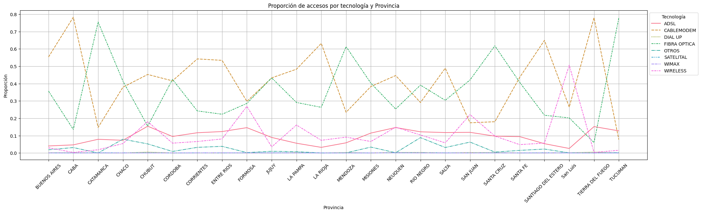
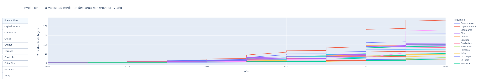
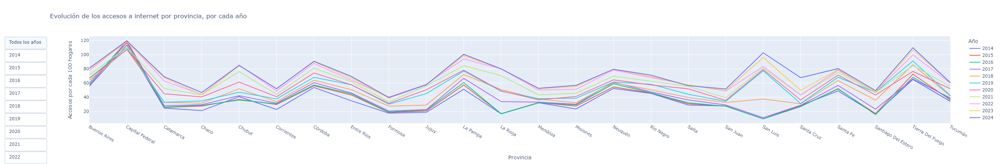
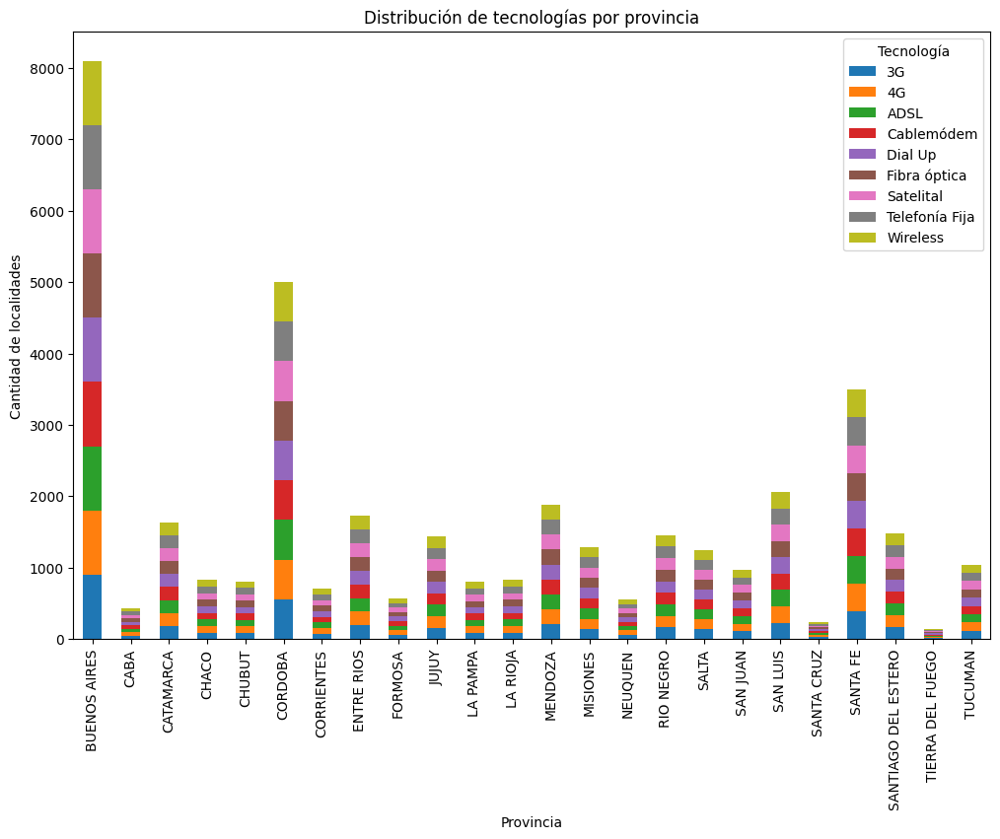

# Dashboard de Conectividad ENACOM con Análisis Predictivo

## Descripción
Este proyecto es una herramienta avanzada de análisis de datos y machine learning para visualizar y predecir la conectividad a internet en Argentina. Desarrollado para ENACOM (Ente Nacional de Comunicaciones), combina visualización interactiva con modelos predictivos para ofrecer una visión completa del estado actual y futuro de la conectividad en el país.

## Características Principales

### 📊 Dashboard Interactivo
- Visualización dinámica de datos de conectividad por provincia
- Filtros interactivos por año y región
- Gráficos de penetración de internet
- Análisis detallado de tecnologías disponibles
- Mapa interactivo de Argentina con datos de conectividad

### 🤖 Análisis Predictivo
- **Modelos de Machine Learning:**
  - Random Forest para predicciones robustas
  - XGBoost para análisis de alta precisión
  - LightGBM para predicciones rápidas
  - Red Neuronal para patrones complejos

- **Características Avanzadas:**
  - Optimización automática de hiperparámetros
  - Análisis de importancia de características
  - Visualización del entrenamiento de modelos
  - Interfaz interactiva para predicciones en tiempo real

## Instalación

1. Clonar el repositorio:
```bash
git clone https://github.com/tu-usuario/dashboard-conectividad-ENACOM.git
cd dashboard-conectividad-ENACOM
```

2. Crear y activar entorno virtual:
```bash
python -m venv env
# Windows:
env\Scripts\activate
# macOS/Linux:
source env/bin/activate
```

3. Instalar dependencias:
```bash
pip install -r requirements.txt
```

4. Ejecutar el dashboard:
```bash
streamlit run dashboard.py
```

## Estructura del Proyecto
```
dashboard-conectividad-ENACOM/
├── data/                   # Datos del proyecto
├── notebooks/             # Jupyter notebooks para análisis
├── images/               # Recursos visuales
├── dashboard.py          # Dashboard principal
├── ml_analysis.py        # Funciones de machine learning
├── ml_dashboard.py       # Dashboard de machine learning
└── requirements.txt      # Dependencias del proyecto
```

## Uso del Dashboard

### Dashboard Principal
1. Seleccione un año y una provincia en la barra lateral
2. Explore los diferentes gráficos y visualizaciones
3. Analice la distribución de tecnologías por provincia
4. Observe las tendencias de penetración de internet

### Sección de Machine Learning
1. Acceda a la página de ML desde el menú lateral
2. Explore los resultados de los diferentes modelos
3. Realice predicciones ingresando valores de entrada
4. Analice la importancia de las características
5. Compare el rendimiento de diferentes modelos

## Tecnologías Utilizadas
- Python 3.x
- Streamlit para la interfaz de usuario
- Pandas y NumPy para el procesamiento de datos
- Scikit-learn, XGBoost, LightGBM para machine learning
- TensorFlow para redes neuronales
- Plotly para visualizaciones interactivas
- SHAP para análisis de importancia de características

## Contribución
Las contribuciones son bienvenidas. Por favor, siga estos pasos:

1. Fork el repositorio
2. Cree una rama para su feature (`git checkout -b feature/NuevaFuncionalidad`)
3. Commit sus cambios (`git commit -m 'Agrega nueva funcionalidad'`)
4. Push a la rama (`git push origin feature/NuevaFuncionalidad`)
5. Abra un Pull Request

## Licencia
Este proyecto está licenciado bajo la Licencia MIT - ver el archivo [LICENSE](LICENSE) para más detalles.

## Contacto
Tu Nombre - [@tutwitter](https://twitter.com/tutwitter) - email@example.com

Link del Proyecto: [https://github.com/tu-usuario/dashboard-conectividad-ENACOM](https://github.com/tu-usuario/dashboard-conectividad-ENACOM)

# Internet Penetration and Quality in Argentina: A Data-Driven Study

This study analyzes internet connectivity in Argentina using public data. It quantifies service penetration, characterizes technologies used, evaluates connection quality, and identifies digital gaps across regions. The findings help understand the current landscape and propose strategies for improved access and service quality.

## Installation & Requirements

1. Clone the repository:
   ```bash
   git clone https://github.com/JuliaGastellu/dashboard-conectividad-ENACOM.git
   ```
2. Create a virtual environment:
   ```bash
   python -m venv env
   ```
3. Activate the environment:
   ```bash
   # Windows:
   env\Scripts\activate
   # macOS/Linux:
   source env/bin/activate
   ```
4. Install dependencies:
   ```bash
   pip install -r requirements.txt
   ```

## Project Structure

- **Data:** Processed CSV files.
- **Notebooks:** Scripts for data cleaning, transformation, and analysis.
- **ETL_PIDA:** Code and results for raw data processing.
- **EDA_PIDA:** Exploratory analysis, including KPI development.
- **Visualizations:** Interactive dashboard files.
- **Documentation:** Project details and methodologies.

## Methodology

1. **Data Acquisition:** Public data from [ENACOM Open Data](https://www.enacom.gob.ar/datosabiertos).
2. **Data Cleaning & Preparation:** Removing duplicates, correcting errors, and handling missing values.
3. **Exploratory Analysis:** Statistical techniques and visualizations to identify patterns and anomalies.
4. **In-Depth Analysis:** Trends in internet technologies, regional differences, and connection speed vs. household income.
5. **KPI Development:** Key performance indicators to assess internet access and evolution.
6. **Visualization:** Results are presented through an interactive dashboard.

## Key Findings

### Technology Trends & Digital Transition

Fiber optic dominates urban areas due to high-speed demand and provider investments. In contrast, wireless technologies (4G/5G) are growing in rural regions, albeit with lower speeds.



### Regional Disparities & Growth Patterns

- **Fiber optic is expanding rapidly** in cities, while older technologies (ADSL, dial-up) decline.
- **Growth rate varies across provinces,** influenced by economic factors, infrastructure investments, and public policies.
- **Public policies play a crucial role**—provinces with proactive telecom investments see faster growth.



### Factors Influencing Connectivity

- **Economic Cycles:** Infrastructure investment fluctuates with economic conditions.
- **Regulatory Policies:** Competition-driven regulations accelerate connectivity growth.
- **External Events:** Pandemics, natural disasters, and geopolitical factors impact service availability.
- **Radio Spectrum Allocation:** Efficient spectrum management is crucial for mobile network expansion.



### Urban vs. Rural Connectivity Gaps

Urban areas benefit from faster technology adoption, while rural regions lag due to lower infrastructure density and provider competition.



## KPIs for Measuring Progress

- **KPI 1: Internet Access Growth** – Increase household internet penetration by 2% per province in the next quarter.
- **KPI 2: Fiber Optic Expansion** – Raise fiber optic adoption by 2% per province.
- **KPI 3: High-Speed Connectivity** – Boost connections over 20 Mbps by 5% in provinces with low speeds.

These KPIs align with strategic goals to expand infrastructure, enhance service quality, and reduce the digital divide.

## Author

- [@JuliaGastellu](https://github.com/JuliaGastellu)


